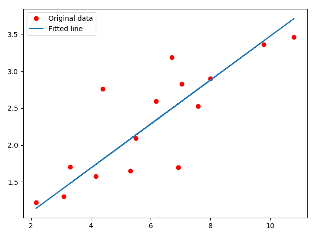

# Task2 设立计算图并自动计算

### 1.numpy和pytorch实现梯度下降法

手动实现反向传播和梯度下降

```python
import torch


dtype = torch.float
device = torch.device("cpu")
# device = torch.device("cuda:0") # Uncomment this to run on GPU

# N is batch size; D_in is input dimension;
# H is hidden dimension; D_out is output dimension.
N, D_in, H, D_out = 64, 1000, 100, 10

# Create random input and output data
x = torch.randn(N, D_in, device=device, dtype=dtype)
y = torch.randn(N, D_out, device=device, dtype=dtype)

# Randomly initialize weights
w1 = torch.randn(D_in, H, device=device, dtype=dtype)
w2 = torch.randn(H, D_out, device=device, dtype=dtype)

learning_rate = 1e-6
# 2层神经网络
for t in range(500):
    # Forward pass: compute predicted y
    h = x.mm(w1)
    h_relu = h.clamp(min=0)
    y_pred = h_relu.mm(w2)

    # Compute and print loss
    loss = (y_pred - y).pow(2).sum().item()
    print(t, loss)

    # Backprop to compute gradients of w1 and w2 with respect to loss
    grad_y_pred = 2.0 * (y_pred - y)
    grad_w2 = h_relu.t().mm(grad_y_pred)
    grad_h_relu = grad_y_pred.mm(w2.t())
    grad_h = grad_h_relu.clone()
    grad_h[h < 0] = 0
    grad_w1 = x.t().mm(grad_h)

    # Update weights using gradient descent
    w1 -= learning_rate * grad_w1
    w2 -= learning_rate * grad_w2
```

细节解释：

`torch.mm`: Performs a matrix multiplication.**This function does not [broadcast](https://pytorch.org/docs/stable/notes/broadcasting.html#broadcasting-semantics). For broadcasting matrix products, see [`torch.matmul()`](https://pytorch.org/docs/stable/torch.html#torch.matmul).**

`torch.clamp`:把 `input` 中的元素值压缩到 [ [`min`](https://pytorch.org/docs/stable/torch.html?highlight=clamp#torch.min), [`max`](https://pytorch.org/docs/stable/torch.html?highlight=clamp#torch.max) ] 范围，and return a resulting tensor。

**现在用自动求导(autograd)**

```python
# Code in file autograd/two_layer_net_autograd.py
import torch

device = torch.device('cpu')
# device = torch.device('cuda') # Uncomment this to run on GPU

# N is batch size; D_in is input dimension;
# H is hidden dimension; D_out is output dimension.
N, D_in, H, D_out = 64, 1000, 100, 10

# Create random Tensors to hold input and outputs
x = torch.randn(N, D_in, device=device)
y = torch.randn(N, D_out, device=device)

# Create random Tensors for weights; setting requires_grad=True means that we
# want to compute gradients for these Tensors during the backward pass.
w1 = torch.randn(D_in, H, device=device, requires_grad=True)
w2 = torch.randn(H, D_out, device=device, requires_grad=True)

learning_rate = 1e-6
for t in range(500):
  # Forward pass: compute predicted y using operations on Tensors. Since w1 and
  # w2 have requires_grad=True, operations involving these Tensors will cause
  # PyTorch to build a computational graph, allowing automatic computation of
  # gradients. Since we are no longer implementing the backward pass by hand we
  # don't need to keep references to intermediate values.
  y_pred = x.mm(w1).clamp(min=0).mm(w2)
  
  # Compute and print loss. Loss is a Tensor of shape (), and loss.item()
  # is a Python number giving its value.
  loss = (y_pred - y).pow(2).sum()
  print(t, loss.item())

  # Use autograd to compute the backward pass. This call will compute the
  # gradient of loss with respect to all Tensors with requires_grad=True.
  # After this call w1.grad and w2.grad will be Tensors holding the gradient
  # of the loss with respect to w1 and w2 respectively.
  loss.backward()

  # Update weights using gradient descent. For this step we just want to mutate
  # the values of w1 and w2 in-place; we don't want to build up a computational
  # graph for the update steps, so we use the torch.no_grad() context manager
  # to prevent PyTorch from building a computational graph for the updates
  with torch.no_grad():
    w1 -= learning_rate * w1.grad
    w2 -= learning_rate * w2.grad

    # Manually zero the gradients after running the backward pass
    w1.grad.zero_()
    w2.grad.zero_()
```

### 2.实现线性回归

[参考链接](https://github.com/yunjey/pytorch-tutorial/blob/master/tutorials/01-basics/pytorch_basics/main.py)

```python
import torch
import torch.nn as nn
import numpy as np
import matplotlib.pyplot as plt


# Hyper-parameters
input_size = 1
output_size = 1
num_epochs = 60
learning_rate = 0.001

# Toy dataset
x_train = np.array([[3.3], [4.4], [5.5], [6.71], [6.93], [4.168], 
                    [9.779], [6.182], [7.59], [2.167], [7.042], 
                    [10.791], [5.313], [7.997], [3.1]], dtype=np.float32)

y_train = np.array([[1.7], [2.76], [2.09], [3.19], [1.694], [1.573], 
                    [3.366], [2.596], [2.53], [1.221], [2.827], 
                    [3.465], [1.65], [2.904], [1.3]], dtype=np.float32)

# Linear regression model
model = nn.Linear(input_size, output_size)

# Loss and optimizer
criterion = nn.MSELoss()
optimizer = torch.optim.SGD(model.parameters(), lr=learning_rate)  

# Train the model
for epoch in range(num_epochs):
    # Convert numpy arrays to torch tensors
    inputs = torch.from_numpy(x_train)
    targets = torch.from_numpy(y_train)

    # Forward pass
    outputs = model(inputs)
    loss = criterion(outputs, targets)
    
    # Backward and optimize
    optimizer.zero_grad()
    loss.backward()
    optimizer.step()
    
    if (epoch+1) % 5 == 0:
        print ('Epoch [{}/{}], Loss: {:.4f}'.format(epoch+1, num_epochs, loss.item()))

# Plot the graph
predicted = model(torch.from_numpy(x_train)).detach().numpy()
plt.plot(x_train, y_train, 'ro', label='Original data')
plt.plot(x_train, predicted, label='Fitted line')
plt.legend()
plt.show()

# Save the model checkpoint
torch.save(model.state_dict(), 'model.ckpt')
```

`nn.Linear(input_size, output_size)`:input_size指的是输入feature的维度(个数)，output——size指的是输出feature的维度。而实际的input形状是$(N, *, H_{in})$,其中N是样本个数。

最后画出来的图：



(未完持续)